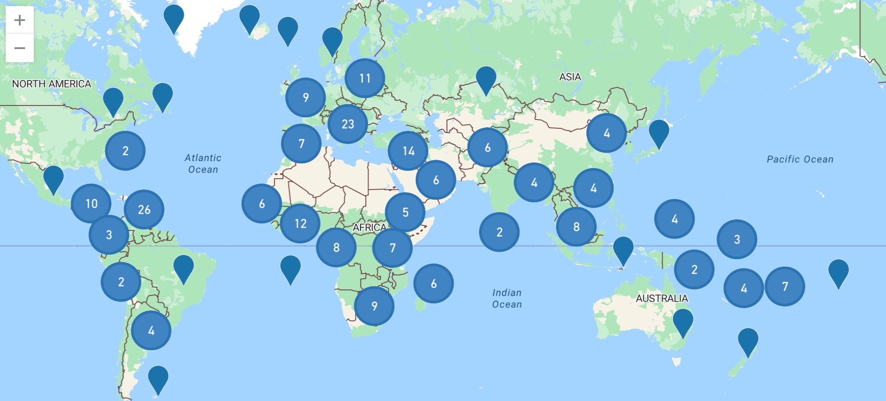

# GeoJSON file with capital cities and their coordinates and ISO2 and ISO3

Since I couldn't find a proper source that could find countries, capitals and their coordinates, I created a GeoJson file myself, which contains all important infos.

Use this link: https://raw.githubusercontent.com/MichiMauch/country_capital-cities_coordinates_iso2-3/main/countries-capitalcities-coordinates-iso2-3.geojson for direct access.

Thanks to reganjohn for his list with all countries, capitals and coordinates https://github.com/reganjohn/BHI/blob/master/topology/country-capitals.csv. I added only ISO2, ISO3, TLD, FIPS, ISON to the new list.
